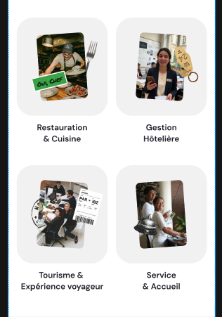

# Edumapper – Page métier & éditeur

## Lancer

```bash
npm install
npm run dev        # http://localhost:3000 → redirige vers /metiers/hotellerie
npm run typecheck  # vue-tsc, TypeScript strict
npm run build
```

- Page publique : `/metiers/hotellerie`
- Éditeur : `/metiers/hotellerie/editor` → bouton **Modifier**, édition inline, **Enregistrer** / **Annuler**

## Choix techniques

### Stockage : localStorage + contenu par défaut versionné dans le code
- 4h : pas de temps pour monter/sécuriser une base. Le contenu par défaut (`app/data/jobs/hotellerie.ts`) est typé `satisfies JobPage`.
- Les modifications de l'éditeur sont enregistrées dans `localStorage` (clé versionnée `edumapper:job:v1:<slug>`) et relues par la page publique.
- Limite assumée : les modifs sont **par navigateur** (pas partagées entre l'équipe).
- Tout l'accès à la donnée passe par `JobRepository` (interface async `find`/`save`). Passer à Supabase / une API Nitro = une nouvelle implémentation, aucun composant à toucher.
- Les données relues sont **validées par zod** : un contenu corrompu est ignoré (fallback sur le défaut), il ne casse pas la page.

### Modèle de données (`shared/schemas/job.ts`)
- Le **schéma zod est la source de vérité**, les types (`shared/types/job.ts`) en sont inférés : pas de double maintenance.
- Une page = `{ slug, title, tagline, sections: JobSection[] }`. `JobSection` est une **union discriminée** sur `type` (`subjobs`, `about`, `faq`, `prosCons`, `cta`, `tips`, `collage`) : l'ordre des sections est l'ordre du tableau.
- Renommages vs brief : `salary → medianStartingSalary`, `open_jobs → openPositions { count, year }` (l'année est affichée), `job_count → professionalsCount`, `formation_count → trainingsCount`, procons `type → kind` (évite la collision avec le discriminant de section).
- Les stickers des cartes métiers sont des données (`x`, `y`, `width`, `rotate` en %) et non du CSS en dur.
- Le collage du bas est une section `collage` : une liste de pièces (même forme que les stickers, l'ordre du tableau = l'ordre d'empilement). Chaque pièce a un `secret: { title, body } | null`. Un personnage avec un secret devient cliquable et ouvre un plein écran flouté (pas de routing). Le secret est rattaché à la pièce plutôt que stocké dans une liste à part : pas d'identifiant croisé à maintenir, et supprimer la pièce supprime son secret.
- La clé de stockage est passée en `v2` avec ce changement de schéma : les anciens brouillons sont ignorés au lieu d'être mal relus.

### Séparation donnée / affichage
| Couche | Rôle |
|---|---|
| `repositories/` | lecture/écriture/validation de la donnée |
| `composables/useJobPage`, `useJobEditor` | orchestration : chargement, 404, brouillon, dirty, save/cancel, déplacement de sections |
| `composables/useListSection`, `useSectionPatch` | opérations immuables génériques sur les items (ajout, suppression, déplacement, édition) |
| `components/job/sections/*` | **affichage pur** : `props: { section }`, `emit('update', section)` ; aucun accès au store |
| `components/editor/*` | primitives inline (`EditableText`, `EditableNumber`, `EditableImage`, `ItemControls`…) qui s'affichent en lecture seule hors mode édition |

- Le mode édition est fourni par `provide/inject` typé (`InjectionKey`) : **les mêmes composants** servent la page publique et l'éditeur (WYSIWYG, pas de duplication).
- `sectionRegistry.ts` : `Record<SectionType, …>` ; ajouter une 15ᵉ section = schéma + composant + 1 ligne, et TypeScript refuse de compiler si on oublie la ligne.

### Éditeur
- Textes, nombres, images (redimensionnées côté client en webp ~60 Ko pour tenir dans localStorage), lien du CTA (validé `http(s)` pour éviter `javascript:`).
- Ajout / suppression / réordonnancement des métiers, questions, plus/moins, conseils ; réordonnancement des sections.
- Secrets du collage : en mode édition, toutes les pièces sont cliquables. Une pièce sans secret en reçoit un par défaut, à éditer dans le plein écran, avec un bouton « Supprimer le secret ».
- Garde-fous : alerte si on quitte avec des modifs non enregistrées, message si le quota localStorage est dépassé.

### Animations
- Cartes métiers : photo qui s'incline + stickers qui apparaissent puis flottent à l'entrée dans le viewport.
- Plus / moins : cartes inclinées qui pivotent à l'échange d'onglet.
- FAQ : accordéon (transition `grid-template-rows`).
- Conseils : pile de cartes navigable au swipe, avec les flèches, en cliquant sur les points ou au clavier (← →).
- Secrets : plein écran avec un flou fort (`backdrop-blur-2xl`), image qui apparaît en « pop », fermeture avec la croix, Échap ou un clic sur le fond, et scroll de la page bloqué pendant l'ouverture.
- Révélation des sections au scroll, stickers du CTA et du footer.
- `prefers-reduced-motion` respecté.

## Avec 2 jours de plus
1. Persistance partagée : Supabase (ou Nitro storage + Vercel KV) derrière `JobRepository`, images sur Vercel Blob, SSR réactivé.
2. Tests : unitaires (`utils/list`, repository, `useJobEditor`), e2e Playwright (éditer → enregistrer → page publique).
3. Éditeur : undo/redo, drag & drop, ajout de sections depuis une palette, édition des stickers, aperçu publié vs brouillon, historique.
4. Fidélité : passe pixel-perfect avec les tokens Figma, animations du Drive.
5. Multi-métiers : liste `/metiers`, création de page depuis l'éditeur.

---

# edu_office


Comme le premier cas pratique, l'interface est dispo à cet url: (host sur vercel via github)

https://edu-office-five.vercel.app/




- question dans la description du readme du test => peut induire en erreur le fait de lister des "sous-jobs"
- attendu animation
- dommage pas d'accès au mcp figma :v
- generation de data random / lorem-ipsum ou 


---

choix

- plug de vercel et bootstrap d'un projet nuxt
- pas de supabase dès le départ (doute sur le timing) => preference de finition. Prise de decision sur la gestion data en localStorage pour pas perdre de temps. Si j'avais eu le temps j'aurai poussé davantage cette partie là.
- partie animation, c'est là ou je suis le moins à l'aise. 

--

question : pq nuxt vs react ou autre framework ? Legacy